 

<h3>Estudante de Ciência da Computação • Java • Backend</h3>

  

---

## Sobre mim

Sou estudante de **Ciência da Computação**, com foco em desenvolvimento **Backend**.

Atualmente estudo e desenvolvo projetos utilizando principalmente **Java, Spring Boot, APIs REST, MySQL, SQL e Python**.

Meu objetivo é transformar o conhecimento adquirido na graduação em projetos práticos, evoluindo continuamente em desenvolvimento de software e fundamentos de backend.

---

## Tecnologias

### Linguagens & Backend

  

### Banco de Dados & Ferramentas

---

## Projetos

&nbsp;&nbsp;

 

---

## GitHub

 

---

## Contribution Snake

---

## GitHub Trophies

---

## Contato

 

 

